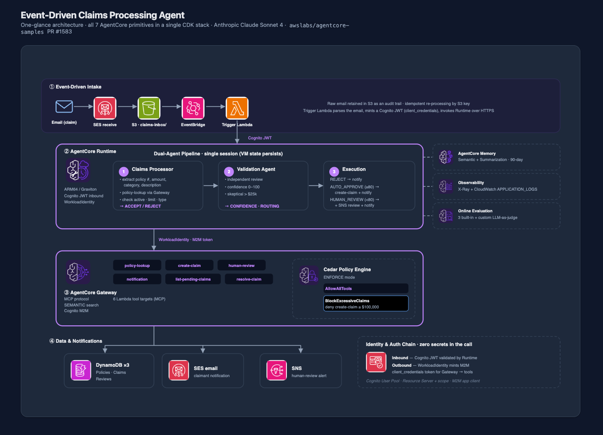

# Event-Driven Claims Processing Agent

> [!IMPORTANT]
> The examples provided in this repository are for experimental and educational purposes only. They demonstrate concepts and techniques but are not intended for direct use in production environments.

An event-driven insurance claims processing system built on **Amazon Bedrock AgentCore**. Claims arrive via email, are processed by a dual-agent architecture (Claims Processor + Validation Agent), and are automatically routed based on confidence scoring — all deployed with a single command using CDK L2 constructs.

This sample demonstrates **every AgentCore Service** (Runtime, Gateway, Identity, Memory, Policy Engine, Observability, Evaluation) working together in a production-realistic architecture.

## Demo

https://github.com/awslabs/agentcore-samples/blob/feat/event-driven-claims-agent/02-use-cases/event-driven-claims-agent/demo.mp4

The demo shows:
1. **Direct invocation** — Agent processes a claim, verifies policy, auto-approves, and sends branded email notification
2. **Cedar policy enforcement** — Gateway blocks a high-value claim exceeding the $100k threshold
3. **Event-driven flow** — Claim uploaded to S3 triggers EventBridge → Lambda → Agent Runtime pipeline

## Architecture



```
┌─────────────────────────────────────────────────────────────────────────────────┐
│                          CDK Stack (76 resources)                                │
├─────────────────────────────────────────────────────────────────────────────────┤
│                                                                                 │
│  ┌──────────┐    ┌──────────────┐    ┌───────────────────────────┐              │
│  │  Email   │    │     SES      │    │     S3 Bucket             │              │
│  │ (Claim)  │───▶│  (Receive)   │───▶│   claims-inbox/           │              │
│  └──────────┘    └──────────────┘    └─────────────┬─────────────┘              │
│                                                    │                            │
│                                      ┌─────────────▼─────────────┐              │
│                                      │      EventBridge          │              │
│                                      │   (S3 PutObject rule)     │              │
│                                      └─────────────┬─────────────┘              │
│                                                    │                            │
│                                      ┌─────────────▼─────────────┐              │
│                                      │    Trigger Lambda         │              │
│                                      │  (Parses email, gets JWT, │              │
│                                      │   invokes Runtime)        │              │
│                                      └─────────────┬─────────────┘              │
│                                                    │                            │
│                          ┌─────────────────────────▼─────────────────────────┐  │
│                          │       AgentCore Runtime (ARM64/Graviton)           │  │
│                          │       Cognito JWT Authentication                  │  │
│                          │                                                   │  │
│                          │  ┌─────────────────────────────────────────────┐  │  │
│                          │  │ Phase 1: Claims Processor (Strands Agent)   │  │  │
│                          │  │ • Extracts claim details                    │  │  │
│                          │  │ • Verifies policy via Gateway               │  │  │
│                          │  │ • Makes ACCEPT/REJECT decision              │  │  │
│                          │  └────────────────────┬────────────────────────┘  │  │
│                          │                       │                            │  │
│                          │  ┌────────────────────▼────────────────────────┐  │  │
│                          │  │ Phase 2: Validation Agent (Strands Agent)   │  │  │
│                          │  │ • Reviews processor decision independently  │  │  │
│                          │  │ • Assigns confidence score (0-100)          │  │  │
│                          │  │ • Routes: AUTO_APPROVE (≥80) or HUMAN_REVIEW│  │  │
│                          │  └────────────────────┬────────────────────────┘  │  │
│                          │                       │                            │  │
│                          │  ┌────────────────────▼────────────────────────┐  │  │
│                          │  │ Phase 3: Execution                          │  │  │
│                          │  │ • Creates claim record (DynamoDB)           │  │  │
│                          │  │ • Sends email notification (SES)            │  │  │
│                          │  │ • OR requests human review (SNS)            │  │  │
│                          │  └────────────────────────────────────────────┘  │  │
│                          └───────────────────────┬───────────────────────────┘  │
│                                                  │                              │
│                          ┌───────────────────────▼───────────────────────────┐  │
│                          │   MCP Gateway (Cognito M2M + WorkloadIdentity)    │  │
│                          │   + Cedar Policy Engine                           │  │
│                          ├───────────────────────────────────────────────────┤  │
│                          │ ┌──────────────┐ ┌──────────────┐ ┌────────────┐ │  │
│                          │ │ policy-lookup│ │ create-claim │ │ list-      │ │  │
│                          │ │   (Lambda)   │ │   (Lambda)   │ │ pending    │ │  │
│                          │ └──────────────┘ └──────────────┘ └────────────┘ │  │
│                          │ ┌──────────────┐ ┌──────────────┐ ┌────────────┐ │  │
│                          │ │ human-review │ │ notification │ │ resolve-   │ │  │
│                          │ │   (Lambda)   │ │  (SES/Lambda)│ │ claim      │ │  │
│                          │ └──────────────┘ └──────────────┘ └────────────┘ │  │
│                          └───────────────────────────────────────────────────┘  │
│                                                                                 │
│  ┌───────────┐  ┌───────────┐  ┌──────────┐  ┌───────────────────────────┐    │
│  │ DynamoDB  │  │  Cognito  │  │   SNS    │  │        Memory             │    │
│  │ (3 tables)│  │ User Pool │  │ (Review) │  │ (Semantic + Summarization)│    │
│  └───────────┘  └───────────┘  └──────────┘  └───────────────────────────┘    │
│                                                                                 │
│  ┌──────────────────────┐  ┌──────────────────────────────────────────────┐    │
│  │ Online Evaluation    │  │ Custom Evaluator (LLM-as-Judge, on-demand)   │    │
│  │ (3 built-in metrics) │  │                                              │    │
│  └──────────────────────┘  └──────────────────────────────────────────────┘    │
│                                                                                 │
│  ┌──────────────────────────────────────────────────────────────────────┐      │
│  │ Observability: AWS X-Ray Tracing + CloudWatch APPLICATION_LOGS       │      │
│  └──────────────────────────────────────────────────────────────────────┘      │
└─────────────────────────────────────────────────────────────────────────────────┘
```

## Table of Contents

- [Event-Driven Claims Processing Agent](#event-driven-claims-processing-agent)
  - [Architecture](#architecture)
  - [Table of Contents](#table-of-contents)
  - [AgentCore Services Demonstrated](#agentcore-services-demonstrated)
  - [Key Features](#key-features)
  - [Prerequisites](#prerequisites)
    - [AWS Account Setup](#aws-account-setup)
    - [Local Tools](#local-tools)
    - [Bedrock Model Access](#bedrock-model-access)
    - [SES Configuration](#ses-configuration)
  - [Deploy](#deploy)
  - [How It Works](#how-it-works)
    - [Event-Driven Flow](#event-driven-flow)
    - [Dual-Agent Processing](#dual-agent-processing)
    - [Confidence-Based Routing](#confidence-based-routing)
    - [Cedar Policy Enforcement](#cedar-policy-enforcement)
  - [Testing](#testing)
    - [End-to-End Test Suite](#end-to-end-test-suite)
    - [Interactive Invocation](#interactive-invocation)
    - [Sample Queries](#sample-queries)
  - [Project Structure](#project-structure)
  - [Configuration](#configuration)
    - [CDK Stack Parameters](#cdk-stack-parameters)
    - [Environment Variables](#environment-variables)
    - [Cedar Policies](#cedar-policies)
  - [Cleanup](#cleanup)
  - [🤝 Contributing](#-contributing)
  - [📄 License](#-license)
  - [🆘 Support](#-support)
  - [🔄 Updates](#-updates)

## AgentCore Services Demonstrated

| Service | Implementation | CDK Construct |
|-----------|---------------|---------------|
| **Runtime** | Dual Strands Agents, containerized, Cognito JWT auth, ARM64/Graviton | `AgentRuntime` (Stable L2) |
| **Gateway** | MCP protocol, 6 Lambda tool targets, Cognito M2M, SEMANTIC search | `Gateway` (Stable L2) |
| **Identity** | Cognito JWT (inbound), WorkloadIdentity (outbound), M2M client_credentials | `WorkloadIdentity` (Stable L2) |
| **Policy Engine** | Cedar: `AllowAllTools` + `BlockExcessiveClaims` ($100k threshold) | `PolicyEngine` (Alpha L2) |
| **Memory** | SEMANTIC + SUMMARIZATION built-in strategies | `Memory` (Stable L2) |
| **Observability** | AWS X-Ray tracing, CloudWatch APPLICATION_LOGS | `ObservabilityConfig` (Stable L2) |
| **Evaluation** | 3 built-in (Helpfulness, Correctness, Tool Selection) + custom LLM-as-judge | `OnlineEvaluation` (Stable L2) |

## Key Features

- **🎯 Single-command deployment** — `./deploy.sh us-west-2` deploys all 76 resources
- **📧 Event-driven email intake** — Claims arrive via email (SES → S3 → EventBridge → Agent)
- **🤖 Dual-agent architecture** — Claims Processor + Validation Agent with independent assessments
- **📊 Confidence-based routing** — Auto-approve (≥80) vs. human review (<80)
- **🛡️ Cedar authorization** — Policy Engine blocks claims exceeding $100k
- **🔐 Full OAuth 2.0** — Cognito JWT (inbound) + M2M client_credentials (outbound)
- **📬 SES email notifications** — Branded HTML email confirmations to claimants
- **🧠 Agent memory** — Semantic recall + conversation summarization
- **📈 Built-in evaluation** — Online quality metrics with LLM-as-judge capability
- **🔍 End-to-end observability** — X-Ray traces + structured CloudWatch logs
- **🐋 Finch container builds** — No Docker Desktop license required (ARM64/Graviton)
- **♻️ CDK L2 constructs** — Infrastructure as Code, no `agentcore deploy` CLI step

## Prerequisites

### AWS Account Setup

1. **AWS Account**: You need an active AWS account with appropriate permissions
   - [Create AWS Account](https://aws.amazon.com/account/)
   - [AWS Console Access](https://aws.amazon.com/console/)

2. **AWS CLI**: Install and configure AWS CLI v2 with your credentials
   - [Install AWS CLI](https://docs.aws.amazon.com/cli/latest/userguide/getting-started-install.html)
   - [Configure AWS CLI](https://docs.aws.amazon.com/cli/latest/userguide/cli-configure-quickstart.html)

   ```bash
   aws configure
   ```

3. **IAM Permissions**: Your AWS user or role needs permissions for:
   - Amazon Bedrock AgentCore (full access)
   - AWS CDK deployments (CloudFormation, IAM, S3, ECR)
   - Amazon Cognito (User Pools, Resource Servers)
   - Amazon DynamoDB (table creation and operations)
   - Amazon SES (sending emails)
   - Amazon SNS (topic creation)
   - Amazon EventBridge (rules)
   - AWS Lambda (function creation)
   - Amazon S3 (bucket creation and operations)
   - Amazon ECR (container image push)
   - AWS X-Ray (tracing)
   - CloudWatch Logs

   **Recommended**: Attach the `AmazonBedrockFullAccess` and `AdministratorAccess` managed policies for development/demo use.

   > [!NOTE]
   > The permissions above are broad for simplicity. In production environments, scope down to specific resources following the principle of least privilege.

### Local Tools

4. **AWS CDK**: Install the AWS CDK CLI
   ```bash
   npm install -g aws-cdk
   ```

5. **Python 3.12+**: Required for CDK stack and agent code
   - [Python Downloads](https://www.python.org/downloads/)

6. **Finch**: Container runtime for building ARM64 images (required for CDK `from_asset()`)
   - [Install Finch](https://github.com/runfinch/finch)

   ```bash
   brew install --cask finch
   finch vm init
   ```

   > [!IMPORTANT]
   > Docker Desktop requires an organization license at Amazon. This sample uses **Finch** as the container runtime. Set `CDK_DOCKER=finch` before deploying (the `deploy.sh` script handles this automatically).

7. **boto3**: AWS SDK for Python (used by test scripts)
   ```bash
   pip install boto3
   ```

### Bedrock Model Access

8. **Enable Bedrock models** in your target AWS region:
   - Navigate to [Amazon Bedrock Console](https://console.aws.amazon.com/bedrock/)
   - Go to "Model access" and request access to:
     - **Anthropic Claude Sonnet 4** (primary model for both agents)
     - **Anthropic Claude 3.5 Haiku** (fallback / evaluation)
   - [Bedrock Model Access Guide](https://docs.aws.amazon.com/bedrock/latest/userguide/model-access.html)

### SES Configuration

9. **Amazon SES Setup** (for email notifications):
   - In **SES sandbox mode** (default), you must verify both sender and recipient email addresses
   - Navigate to [SES Console](https://console.aws.amazon.com/ses/) → Verified identities
   - Verify the sender email configured in the stack
   - Verify any recipient emails you want to test with
   - For production, request production access to remove sandbox restrictions

   > [!NOTE]
   > The event-driven email intake (SES receiving) requires domain verification and MX record configuration. For testing, use `test_invoke.py` to bypass the email trigger and invoke the agent directly.

## Deploy

Deployment creates **all 76 resources** in a single CDK stack — no separate `agentcore deploy` step required.

```bash
# Clone and navigate to the project
cd event-driven-claims-agent

# Deploy everything to your target region
./deploy.sh us-west-2
```

The deploy script performs three steps:

1. **Clean up** — Removes orphaned CloudWatch log groups (prevents CDK "already exists" errors)
2. **CDK deploy** — Synthesizes and deploys the full stack (infra + all AgentCore Services)
3. **Seed data** — Populates DynamoDB with sample insurance policies for testing

<details>
<summary><strong>What gets deployed (76 resources)</strong></summary>

| Category | Resources |
|----------|-----------|
| **AgentCore** | Runtime, Gateway, Memory, Policy Engine, Online Evaluation |
| **Compute** | 7 Lambda functions (6 tools + 1 trigger), 1 ECS/Fargate runtime container |
| **Storage** | 3 DynamoDB tables (policies, claims, reviews), 1 S3 bucket (email inbox) |
| **Auth** | Cognito User Pool, Resource Server, App Client, WorkloadIdentity |
| **Events** | EventBridge rule, S3 event notification |
| **Notifications** | SES (email), SNS topic (human review alerts) |
| **Observability** | X-Ray tracing config, CloudWatch log groups |
| **Networking** | IAM roles, policies, security groups |

</details>

<details>
<summary><strong>Manual deployment (step-by-step)</strong></summary>

If you prefer to deploy manually:

```bash
# Set environment
export AWS_DEFAULT_REGION=us-west-2
export CDK_DOCKER=finch

# Install CDK dependencies
cd infra
python3 -m venv .venv
source .venv/bin/activate
pip install -r requirements.txt

# Bootstrap CDK (first time only)
cdk bootstrap

# Deploy
cdk deploy --require-approval never

# Seed sample data
deactivate
cd ..
python3 scripts/seed_dynamodb.py --region us-west-2
```

</details>

## How It Works

### Event-Driven Flow

```
┌────────┐     ┌─────┐     ┌────────────┐     ┌──────────────┐     ┌─────────────┐
│ Email  │────▶│ SES │────▶│ S3 Bucket  │────▶│ EventBridge  │────▶│   Trigger   │
│(claim) │     │     │     │claims-inbox│     │  (S3 rule)   │     │   Lambda    │
└────────┘     └─────┘     └────────────┘     └──────────────┘     └──────┬──────┘
                                                                          │
                                                                          │ JWT token
                                                                          │ (client_credentials)
                                                                          ▼
                                                                   ┌─────────────┐
                                                                   │  AgentCore  │
                                                                   │  Runtime    │
                                                                   └─────────────┘
```

1. **Email arrives** — Customer sends claim via email to the configured SES address
2. **SES stores in S3** — Raw email is stored in `s3://<bucket>/claims-inbox/<message-id>`
3. **EventBridge triggers** — S3 PutObject event matching `claims-inbox/` prefix fires the rule
4. **Trigger Lambda** — Parses the email, obtains a Cognito JWT token via client_credentials flow, and invokes the AgentCore Runtime via HTTPS
5. **Agent processes** — Dual-agent pipeline runs (see below)
6. **Notification sent** — Claimant receives email confirmation via SES

> [!NOTE]
> The S3 persistence provides an **audit trail** — every claim email is retained for compliance. Claims can be re-processed by re-triggering from the S3 object (idempotent via S3 key).

### Dual-Agent Processing

The runtime contains two sequential Strands agents that operate as an internal pipeline:

#### Phase 1: Claims Processor

- Extracts structured data from the free-text claim (policy number, amount, category, description)
- Calls `policy-lookup` tool via MCP Gateway to verify the policy exists, is active, and covers the claim type
- Makes an **ACCEPT** or **REJECT** decision with detailed reasoning
- Checks: policy active? amount within coverage limit? claim type covered? notes deductible

#### Phase 2: Validation Agent

- Receives the processor's decision + original claim as input
- Independently reviews for errors, inconsistencies, or red flags
- Assigns a **confidence score** (0–100):
  - `90–100`: Clear-cut, obviously correct
  - `80–89`: Sound decision, minor questions
  - `60–79`: Concerns present, needs human review
  - `0–59`: Significant issues, must escalate
- Determines routing: `AUTO_APPROVE` or `HUMAN_REVIEW`

#### Phase 3: Execution

Based on the routing decision:

| Scenario | Action |
|----------|--------|
| **REJECT** | Sends rejection email with reasoning |
| **AUTO_APPROVE** (confidence ≥80) | Creates claim in DynamoDB + sends approval email |
| **HUMAN_REVIEW** (confidence <80) | Creates claim + publishes to SNS for human review + notifies claimant of pending review |

### Confidence-Based Routing

```
                    Validator Output
                         │
                         ▼
              ┌─────────────────────┐
              │  Confidence Score   │
              └─────────┬───────────┘
                        │
              ┌─────────┴───────────┐
              │                     │
         ≥ 80 │                     │ < 80
              ▼                     ▼
    ┌─────────────────┐   ┌─────────────────┐
    │  AUTO_APPROVE   │   │  HUMAN_REVIEW   │
    │                 │   │                 │
    │ • create_claim  │   │ • create_claim  │
    │ • send_notif    │   │ • human_review  │
    │   (approval)    │   │ • send_notif    │
    └─────────────────┘   │   (pending)     │
                          └─────────────────┘
```

### Cedar Policy Enforcement

The Policy Engine enforces authorization rules **before** tool execution:

```cedar
// Policy 1: Allow all tools for authenticated agents
permit (
    principal,
    action,
    resource
);

// Policy 2: Block excessive claims (≥$100,000)
forbid (
    principal,
    action == Action::"ToolUse",
    resource
) when {
    resource.tool_name == "create-claim" &&
    context.estimated_amount >= 100000
};
```

When an agent attempts to create a claim for ≥$100,000, the Policy Engine **denies** the tool call, and the agent must route to human review regardless of confidence score.

## Testing

### End-to-End Test Suite

Runs 5 comprehensive scenarios covering all routing paths:

```bash
python3 scripts/test_e2e.py --region us-west-2
```

| Test | Scenario | Expected Outcome |
|------|----------|-----------------|
| 1 | Normal claim ($7,500 storm damage) | Auto-approved (confidence ≥80) |
| 2 | Excessive claim ($150,000 total loss) | Cedar policy blocks `create-claim` |
| 3 | Vague claim (low detail) | Human review (low confidence) |
| 4 | Expired policy | Rejected by Claims Processor |
| 5 | Event-driven flow (S3 → EventBridge → Agent) | Full E2E via email trigger |

Run a specific test:

```bash
python3 scripts/test_e2e.py --region us-west-2 --test 1
```

### Interactive Invocation

Invoke the agent directly with a custom prompt and see streamed output:

```bash
python3 scripts/test_invoke.py --region us-west-2

# With a custom prompt
python3 scripts/test_invoke.py --region us-west-2 \
  --prompt "I need to file a claim. Policy POL-2024-001. Tree fell on my car during a storm. $7,500 damage."
```

### Sample Queries

Try these prompts to exercise different code paths:

```bash
# 1. Standard auto-approved claim
"I need to file a claim under policy POL-2024-001. Storm damage to my vehicle, tree branch fell on the roof. Estimated $7,500 in repairs."

# 2. Cedar policy block (≥$100k)
"File a claim for POL-2024-003. My car was totaled in a multi-vehicle accident. Total loss estimated at $150,000."

# 3. Human review (vague description)
"I want to file a claim. Something happened to my car. It's broken."

# 4. Rejected (inactive policy)
"Claim under policy POL-EXPIRED-001. Water damage from burst pipe. $12,000 to repair."

# 5. High-value but under threshold (tests validator skepticism)
"Policy POL-2024-002. House fire in the garage, extensive damage to structure and contents. Estimated $85,000."
```

## Project Structure

```
event-driven-claims-agent/
├── README.md                          # This file
├── AGENTS.md                          # Agent prompt engineering documentation
├── deploy.sh                          # One-command deployment script
├── cdk-outputs.json                   # CDK deployment outputs (auto-generated)
│
├── app/                               # Agent runtime application
│   └── claimsagent/
│       ├── Dockerfile                 # ARM64 container image (Graviton)
│       ├── main.py                    # Dual-agent entrypoint (Strands + BedrockAgentCoreApp)
│       ├── pyproject.toml             # Python dependencies (strands, bedrock-agentcore-runtime)
│       ├── requirements.txt           # Pip-compatible deps
│       ├── mcp_client/                # MCP Gateway client configuration
│       └── model/                     # Model loading utilities
│
├── infra/                             # CDK infrastructure stack
│   ├── app.py                         # CDK app entrypoint
│   ├── claims_infra_stack.py          # Main stack (all 76 resources)
│   ├── cdk.json                       # CDK configuration
│   └── requirements.txt              # CDK dependencies (aws-cdk-lib, alpha constructs)
│
├── lambdas/                           # MCP Gateway tool implementations
│   ├── policy_lookup/                 # Verifies policy details from DynamoDB
│   ├── create_claim/                  # Creates claim record in DynamoDB
│   ├── list_pending_claims/           # Lists claims awaiting review
│   ├── human_review/                  # Publishes review request to SNS
│   ├── notification/                  # Sends branded HTML email via SES
│   ├── resolve_claim/                 # Resolves reviewed claims
│   ├── trigger/                       # EventBridge → Agent invocation (JWT)
│   └── schemas/                       # JSON schemas for MCP tool definitions
│
├── scripts/                           # Deployment and testing utilities
│   ├── test_e2e.py                    # Comprehensive E2E test suite (5 scenarios)
│   ├── test_invoke.py                 # Interactive agent invocation with streaming
│   ├── seed_dynamodb.py               # Populates sample policy data
│   └── get_token.py                   # Cognito token utility
│
├── tests/                             # Test fixtures
│   └── sample-claim-email.txt         # Sample email for event-driven testing
│
└── docs/                              # Documentation
    └── ARCHITECTURE.md                # Detailed architecture decisions & rationale
```

## Configuration

### CDK Stack Parameters

The stack is configured in `infra/claims_infra_stack.py`. Key parameters:

| Parameter | Description | Default |
|-----------|-------------|---------|
| `stack_name` | CloudFormation stack name | `ClaimsInfraStack` |
| `region` | Deployment region | From `CDK_DEFAULT_REGION` |
| `model_id` | Bedrock model for agents | `anthropic.claude-sonnet-4-20250514-v1:0` |
| `memory_strategies` | Memory types enabled | `SEMANTIC`, `SUMMARIZATION` |
| `evaluation_metrics` | Built-in online eval metrics | Helpfulness, Correctness, Tool Selection |
| `policy_validation_mode` | Cedar policy strictness | `IGNORE_ALL_FINDINGS` |

### Environment Variables

The runtime receives these environment variables (injected by CDK):

| Variable | Description |
|----------|-------------|
| `AGENTCORE_GATEWAY_URL` | MCP Gateway HTTPS endpoint |
| `AGENTCORE_GATEWAY_TOKEN_ENDPOINT` | Cognito token URL for M2M auth |
| `AGENTCORE_GATEWAY_OAUTH_SCOPES` | OAuth scopes for gateway access |
| `AGENTCORE_GATEWAY_CLIENT_ID` | Cognito app client ID |
| `AGENTCORE_GATEWAY_CLIENT_SECRET` | Cognito app client secret |

### Cedar Policies

Two policies are deployed via the CDK Alpha construct:

1. **AllowAllTools** — Permits all tool actions on the gateway for authenticated principals
2. **BlockExcessiveClaims** — Forbids `create-claim` when `estimated_amount >= 100000`

> [!NOTE]
> The `IGNORE_ALL_FINDINGS` validation mode is required for the permit-all policy. This is a known platform constraint — the Policy Engine rejects "overly permissive" policies without it.

### CDK Dependencies

```
aws-cdk-lib==2.257.0                    # Stable L2 constructs
aws-cdk.aws-bedrock-agentcore-alpha      # Policy Engine (Alpha)
constructs>=10.0.0,<11.0.0
```

## Cleanup

Remove all deployed resources:

```bash
cd infra
source .venv/bin/activate
cdk destroy --force
deactivate
```

This destroys the entire CloudFormation stack including all AgentCore Services, DynamoDB tables, Lambda functions, and Cognito resources.

> [!CAUTION]
> DynamoDB tables use `DESTROY` removal policy in this sample. All claim data will be permanently deleted. In production, use `RETAIN` or enable point-in-time recovery.

> [!NOTE]
> **Name retention**: AgentCore Policy Engine and Memory names are reserved for 24-48 hours after deletion. If you need to redeploy immediately, use a different name suffix.

## 🤝 Contributing

We welcome contributions! Please see our [Contributing Guidelines](../../CONTRIBUTING.md) for details on:

- Adding new samples
- Improving existing examples
- Reporting issues
- Suggesting enhancements

## 📄 License

This project is licensed under the MIT License - see the [LICENSE](../../LICENSE) file for details.

## 🆘 Support

- **Issues**: Report bugs or request features via [GitHub Issues](https://github.com/awslabs/amazon-bedrock-agentcore-samples/issues)
- **Documentation**: See [docs/ARCHITECTURE.md](./docs/ARCHITECTURE.md) for detailed architecture decisions and rationale
- **AgentCore Docs**: [Amazon Bedrock AgentCore Documentation](https://docs.aws.amazon.com/bedrock/latest/userguide/agentcore.html)

## 🔄 Updates

This repository is actively maintained and updated with new capabilities and examples. Watch the repository to stay updated with the latest additions.
